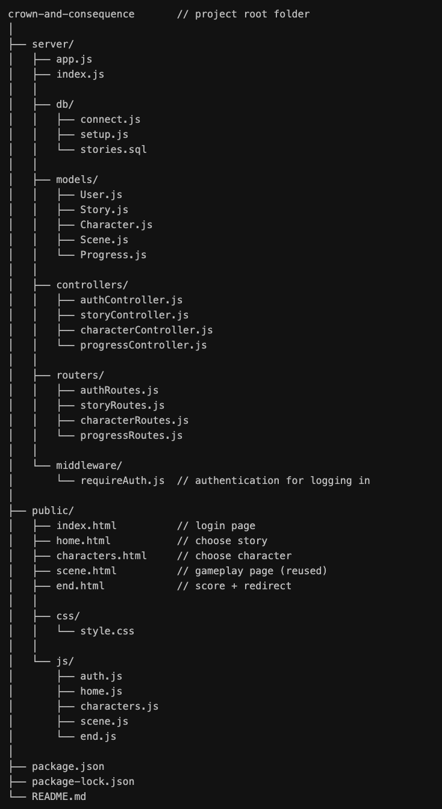
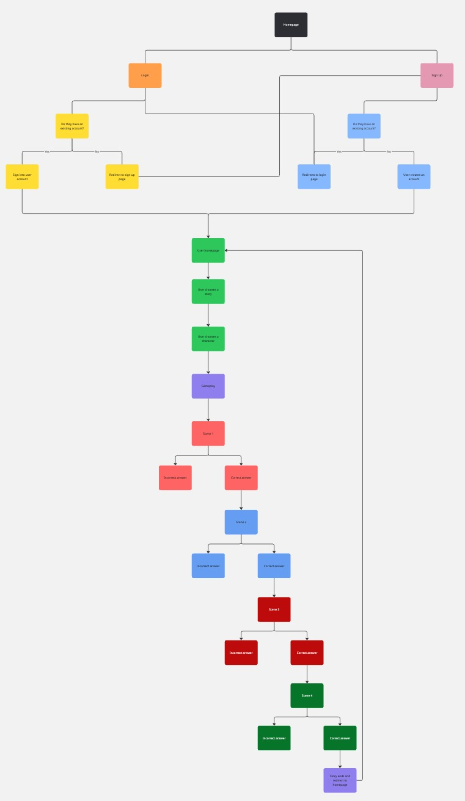
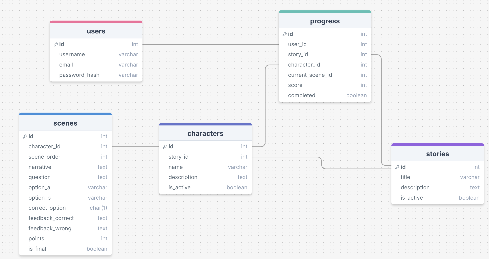

# Crown and Consequence

Crown and Consequence is a decision-based educational web application designed to help students explore historical narratives through interactive storytelling. Students progress through stories by making choices, receiving feedback, and earning points based on their decisions.

The project focuses on demonstrating clean backend architecture, RESTful API design, and clear separation of concerns using the Model–View–Controller (MVC) pattern.

---

## Project Overview

Crown and Consequence allows students to engage with history in an interactive way. After signing up or logging in, students can select a historical story, choose a character, and progress through a sequence of scenes. Each scene presents narrative context and a decision point, reinforcing learning through feedback and scoring.

The application is built as a minimum viable product (MVP), with a single playable story and character, while being designed to scale to multiple stories, characters, and branching narratives in the future.

---

## Tech Stack

- Node.js
- Express.js
- PostgreSQL
- JavaScript
- HTML
- CSS

### Planning & Design Tools
- DrawSQL (database schema design)
- Miro (wireframing and decision tree planning)

---

## Architecture Overview

This project follows the Model–View–Controller (MVC) architecture pattern:

- **Models** handle database access and represent application data
- **Controllers** contain business logic and coordinate between models and routes
- **Routers** define API endpoints and delegate logic to controllers

Nested routing is used to reflect the domain relationships between stories, characters, and scenes. This approach ensures routes closely mirror the user journey and enforces logical data hierarchy.



---

## User Journey

1. User signs up or logs in
2. User is presented with available stories
3. User selects a story
4. User selects a character related to that story
5. User progresses through scenes by making decisions
6. User receives feedback and points for correct answers
7. Progress and score are saved
8. User can return later and resume from their last scene



---

## Features

- User authentication (signup and login)
- Story selection
- Character selection based on chosen story
- Sequential scene progression
- Decision-based questions with feedback
- Scoring system based on correct answers
- Persistent progress tracking

---

## Future Features

- Multiple playable stories and characters
- Branching storylines based on user decisions
- Leaderboards and score comparisons
- Enhanced progress analytics
- Improved frontend UI and animations
- Admin tools for story and scene management

---

## API Overview

The backend exposes the following core resources:

- `/auth` — user authentication (signup and login)
- `/stories` — retrieve available stories
- `/stories/:storyId/characters` — retrieve characters for a selected story
- `/stories/:storyId/characters/:characterId/scenes` — retrieve and progress through scenes
- `/progress` — track user progress, score, and completion status

---

## Database Design

The database is structured to support story progression and persistent gameplay. Core entities include users, stories, characters, scenes, and progress. Relationships are enforced using foreign keys to ensure data integrity and consistent progression tracking.

The schema was designed and visualised using DrawSQL prior to implementation.



---

## Installation

To run the project locally:

1. Clone the repository
2. Install dependencies:
   ```bash
   npm install
   ```
3. Create a PostgreSQL database and configure environment variables
4. Run database migrations or schema setup
   ```bash
   npm run setup-db
   ```
5. Start the server:
   ```bash
   npm run dev
   ```
6. Open the application in your browser

---

## Known Limitations
- Only one story and character are fully playable in the MVP
- Scene progression is linear and does not yet branch
- No password reset or account recovery functionality
- Frontend is functional but minimal

---

## Collaborators
- Clarence Okafor
- Leanne Goldsmith
- Matthew Thomas
- Max Crust
- Olivia Gie

---

## References & Resources

Below are the key resources that explain the architectural decisions used in this project:

### Tools Used for Planning
- **DrawSQL** — Used for designing and visualising the database schema: https://drawsql.app/
- **Miro** — Used for wireframing the app flow and decision trees: https://miro.com/

### Routing & Nested Routes in Express
- **Nested Routes & mergeParams**  
  When defining nested routes like `/stories/:storyId/characters/:characterId/scenes`, Express requires `mergeParams: true` to access route parameters from parent routers.  
  https://www.compilenrun.com/docs/framework/express/express-nested-routes/
  https://exchangetuts.com/rest-with-expressjs-nested-router-1639485544318258

### API Organisation with Routers
- **Express Router Pattern**  
  Grouping routes into separate modules makes the code modular and maintainable.  
  https://www.geeksforgeeks.org/express-js-express-router-function/

### RESTful API Design
- **REST & Dynamic Routing**  
  Resources are structured hierarchically to reflect real domain relationships (e.g., stories → characters → scenes).  
  https://codecookies.xyz/express-tutorial/v1/rest-and-dynamic-routing/

---

## Licence

This project was created for educational purposes.